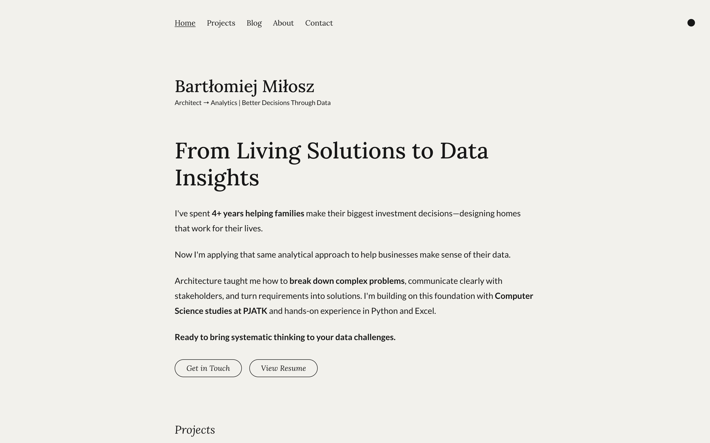
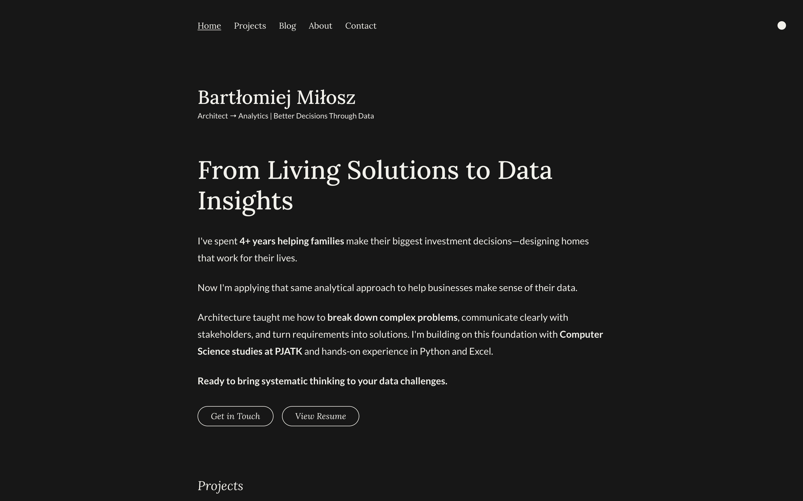

# Bartłomiej Miłosz - Portfolio Website

A modern, responsive portfolio showcasing my transition from interior architecture to data analytics. Demonstrates technical skills, project management experience, and systematic problem-solving approach.

**Live Portfolio:** [https://bartlomiej-milosz.github.io](https://bartlomiej-milosz.github.io)

## About This Project

This portfolio website represents my approach to technical challenges: **systematic planning, clean execution, and user-focused design**. Built while transitioning careers, it demonstrates both my growing technical skills and my ability to deliver professional web solutions.

### Technical Decisions & Why

**Astro.js Framework Choice:**

- Static site generation for optimal performance
- Component-based architecture for maintainability
- TypeScript integration for type safety
- SEO optimization built-in

**Design & UX Strategy:**

- Mobile-first responsive design
- Dark/light mode supporting user preferences
- Clean typography hierarchy for professional presentation
- Performance-focused loading with optimized assets

**Content Architecture:**

- Structured markdown content with type-safe collections
- Dynamic routing for scalable blog/project management
- SEO-optimized meta tags and structured data
- Professional resume integration with download functionality

## My Background

**Interior Architect → Data Analytics Professional**

Combining **4+ years of client consulting experience** with growing technical expertise in Python and data analysis. Currently studying Computer Science at PJATK Warsaw while building practical analytical skills through real projects.

**What this portfolio demonstrates:**

- Systematic approach to learning new technologies
- Ability to deliver complete, professional solutions
- Strong attention to detail and user experience
- Communication skills through clear content presentation

## Technical Stack

**Frontend & Build:**

- Astro.js (Static Site Generation)
- TypeScript (Type Safety)
- Tailwind CSS (Utility-First Styling)

**Content & SEO:**

- Markdown/MDX Content Collections
- Structured Data (Schema.org)
- OpenGraph & Twitter Cards
- Sitemap & RSS Feed Generation

**Development & Deployment:**

- Git Version Control
- GitHub Actions (Automated Deployment)
- GitHub Pages Hosting
- Performance Optimization

## Key Features Implemented

- **Professional Portfolio Sections** - Projects, resume, about, contact  
- **Responsive Design** - Mobile-first approach across all devices  
- **Theme System** - Dark/light mode with smooth transitions  
- **SEO Optimization** - Meta tags, structured data, performance  
- **Content Management** - Type-safe markdown collections  
- **Performance Focused** - Optimized loading and Core Web Vitals

## Project Highlights

**Planning & Architecture:**

- Systematic content strategy reflecting career transition narrative
- Component-based design system for consistency
- Performance-optimized asset handling

**Technical Implementation:**

- Custom TypeScript configurations for type safety
- Advanced Tailwind CSS theming system
- Structured data implementation for search engine optimization
- Automated deployment pipeline with GitHub Actions

**Business Focus:**

- Professional presentation suitable for recruitment
- Clear value proposition and career positioning
- Conversion-optimized contact and resume sections

## Contact & Professional Links

**Bartłomiej Miłosz**  
**Email:** [bartlomiej.milosz@gmail.com](mailto:bartlomiej.milosz@gmail.com)  
**LinkedIn:** [linkedin.com/in/bartłomiej-miłosz](https://www.linkedin.com/in/bart%C5%82omiej-mi%C5%82osz-76015b1ba/)  
**GitHub:** [github.com/bartlomiej-milosz](https://github.com/bartlomiej-milosz)  
**Location:** Warsaw, Poland

**Currently seeking:** Junior Data Analyst positions | Remote/Hybrid welcome

---

_This portfolio demonstrates my systematic approach to technical challenges and commitment to delivering professional, user-focused solutions. Interested in discussing data analytics opportunities or technical collaboration? Let's connect!_
